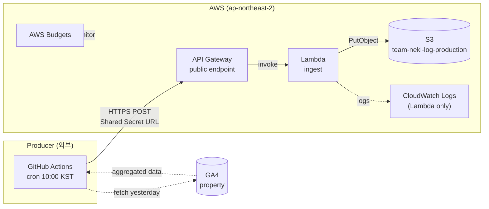
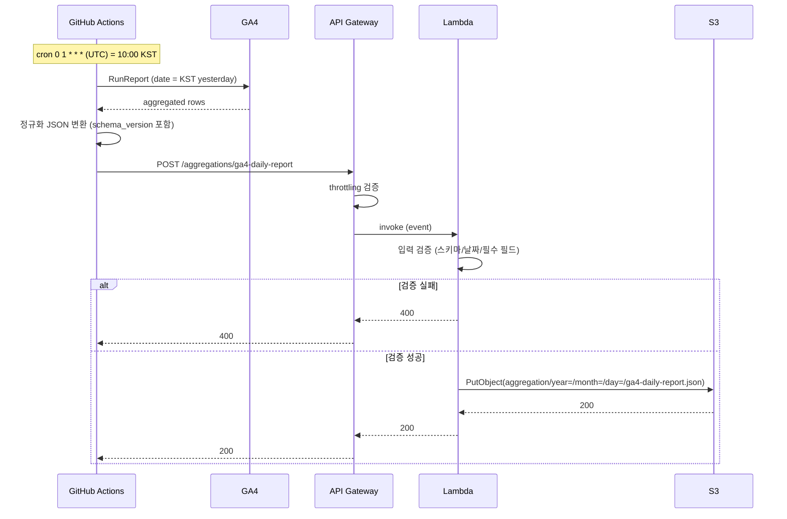

# HLD: Aggregation

## 1. Overview

Team-Neki-Log의 **aggregation** 토픽은 네키 앱 도메인의 **일간 집계 데이터를 수신·저장**하는 책임을 가진다. 외부 Producer(GitHub Actions cron 등)가 매일 정규화된 JSON 페이로드를 HTTPS로 전송하면, 본 시스템이 검증 후 S3에 영구 저장한다. 저장된 데이터는 별도 분석 모듈/레포가 소비한다.

상세 의사결정 배경은 [ADR-0001](../adr/0001-aggregation-storage-on-s3.md) 참조.

## 2. Scope

### In Scope
- HTTPS endpoint 제공 (집계 페이로드 수신)
- 페이로드 검증 (스키마, 날짜 범위, 필수 필드)
- S3 영구 저장 (Hive-style 파티션 경로)
- 운영 안전장치 (throttling, 입력 검증, 비용 알림, concurrency 제한)

### Out of Scope
- 데이터 **분석/조회/시각화** (별도 모듈/레포 책임)
- Producer 측 데이터 수집 로직 (예: GA4 호출, Discord 알림)
- 원본 로그(raw) 수집 (향후 별도 ADR/HLD)
- 다환경 운영, 다계정 격리, 실시간 처리

## 3. Architecture

### 3.1 Component Diagram



### 3.2 Data Flow



## 4. Components

### 4.1 Producer (외부, 참고)
- **위치**: Team-Neki-Log 책임 영역 밖. 별도 레포/시스템이 호출자
- **책임**: 일정에 따라 집계 데이터를 정규화 JSON으로 본 시스템에 POST
- **현재 1차 Producer**: GitHub Actions cron + Python 스크립트 (GA4 호출 후 POST)
- **입력**: 시간 트리거 (cron)
- **출력**: 본 시스템 API Gateway endpoint에 HTTPS POST
- **본 시스템에 대한 기대**: Shared Secret URL 보관, 정규화된 JSON 송신, 4xx 응답 시 페이로드 수정, 5xx 응답 시 재시도

### 4.2 API Gateway
- **유형**: REST API (또는 HTTP API) — public endpoint
- **책임**:
  - HTTPS 종단
  - 기본 요청 검증 (Content-Type, body size)
  - Throttling (10 req/sec, 일 1000건)
  - Lambda 동기 invocation
  - Lambda 응답을 호출자에게 전달
- **입력**: HTTPS POST + JSON body
- **출력**: Lambda 응답 (HTTP 2xx/4xx/5xx)
- **실패 모드**:
  - 한도 초과 → 429 Too Many Requests
  - Lambda 호출 실패 → 5xx
  - 인증 없음 (Public)

### 4.3 Lambda (ingest)
- **책임**:
  - 페이로드 파싱
  - 입력 검증 (schema_version, report_date 범위/형식, 필수 필드)
  - S3 객체 키 구성 (`aggregation/year=/month=/day=/ga4-daily-report.json`)
  - S3 PutObject
  - 응답 반환
- **입력**: API Gateway proxy event
- **출력**: HTTP 응답 객체
- **Concurrency**: Reserved Concurrency = 2
- **실패 모드**:
  - 검증 실패 → 400 + 에러 메시지
  - S3 PUT 실패 → 5xx (Producer 재시도 유도)
  - 미처리 예외 → 5xx + CloudWatch Logs 기록

### 4.4 S3
- **버킷**: `team-neki-log-production`
- **책임**:
  - 집계 객체의 영구 저장
  - 외부 소비자에 대한 데이터 contract 제공 (경로/포맷 안정성)
- **객체 레이아웃**:
  ```
  aggregation/year=YYYY/month=MM/day=DD/ga4-daily-report.json
  ```
- **운영 속성**:
  - Versioning: OFF
  - Lifecycle: 없음 (Standard 영구)
  - Public Access Block: 활성화
  - 암호화: SSE-S3 (기본)
- **확장 영역**: 향후 `raw/...` prefix가 같은 버킷에 추가될 수 있음

## 5. External Integrations

### 5.1 GA4
- **역할**: Producer가 데이터를 가져오는 원천 (본 시스템과 직접 통신 없음)
- **본 시스템과의 관계**: 간접적 — Producer 책임 영역에서 처리됨

### 5.2 AWS
- **이용 서비스**: API Gateway, Lambda, S3, IAM, CloudWatch Logs (Lambda only), AWS Budgets
- **리전**: ap-northeast-2 (Seoul) 단일

## 6. Cross-cutting Concerns

### 6.1 Security
- **인증 모델**: Public endpoint + Shared Secret URL (URL = GitHub Actions Secret)
- **데이터 보호**:
  - HTTPS 전송 (API Gateway 자동)
  - 저장 시 SSE-S3 암호화 (S3 기본)
  - Public Access Block으로 우발적 노출 차단
- **데이터 무결성**: Lambda 입력 검증, S3 키 고정으로 멱등 덮어쓰기
- **재검토 트리거**: PII/매출 정보 포함 시, URL 노출 사고 시 (→ ADR-0001 참조)

### 6.2 Observability
- **로그**:
  - Lambda: `/aws/lambda/team-neki-log-aggregation-production-ingest` (CloudWatch Logs, retention 14일)
  - API Gateway access logs: 비활성화 (Lambda 로그로 충분)
- **메트릭** (CloudWatch 기본 메트릭, 별도 설정 불필요):
  - Lambda: Invocations / Errors / Duration
  - API Gateway: Count / 4XXError / 5XXError
- **알림**: AWS Budgets 월 $5 한도 초과 시 이메일

### 6.3 Cost
- **예상 월 비용**: < $1 (대부분 펜니 미만)
- **주요 비용 항목**:
  - API Gateway: 월 ~30회 호출 → $0.00003
  - Lambda: 월 ~30회 호출 → 무료 영역
  - S3 Storage: 월 수십 KB → 펜니 미만
  - S3 PUT: 월 ~30건 → 무료 영역
  - CloudWatch Logs: 월 ~100 KB → 펜니 미만 (12개월 free tier 5GB 적용 시 0)
- **비용 보호**: AWS Budgets 월 $5 알림, Lambda Reserved Concurrency = 2

### 6.4 Failure & Recovery
- **단일 일자 실패 시**: Producer가 GitHub Actions `workflow_dispatch`로 재실행 → S3 객체가 동일 키로 덮어쓰기 (멱등)
- **데이터 유실 허용**: Versioning OFF 결정. 의도된 트레이드오프 (ADR-0001)
- **AWS 서비스 장애**: 본 시스템 영역 외. AWS 복구 후 Producer 재실행으로 처리

## 7. Deployment Model

- **Environment**: prod 단일
- **AWS Account**: 단일 계정
- **Region**: ap-northeast-2 (Seoul)
- **Topology**: 단일 리전, 단일 환경. 멀티 AZ 가용성은 사용 AWS 서비스(S3 / Lambda / API Gateway) 자체의 관리 영역
- **선정 근거**: 데이터/사용자가 한국 중심이고 GA4 reporting timezone이 KST 기준이므로 동일 리전에서 운영

## 8. Assumptions & Constraints

### Assumptions
- 본 시스템은 GA4 reporting timezone이 KST (GMT+09:00)임을 전제로 한다.
  - Producer가 호출하는 GA4 property(`524989384`)의 reporting timezone 설정값이 KST이어야 함
  - timezone 설정 변경 시 S3 경로의 `day=` 값 의미가 달라지므로 본 시스템 contract와 불일치 가능 → 변경 시 Producer 측에서 보정 필요
- Producer는 일 1회 호출 패턴 (트리거 시간 변경 시 Producer 측에서 KST 일자 계산 책임)
- 페이로드 크기 < 1 MB (API Gateway payload 한도 10 MB 내 충분히 안전)
- 외부 소비자는 S3 객체에 IAM으로 접근 가능

### Constraints
- API Gateway request payload 최대 10 MB
- Lambda 실행 시간 최대 15분 (현재 사용량 대비 충분히 여유)
- S3 객체 키 길이 최대 1024 bytes (현재 키 ~80 bytes)
- 인증 없는 public endpoint → URL 비밀 유지가 운영 책임의 핵심

## 9. References
- [ADR-0001: Aggregation Storage on S3](../adr/0001-aggregation-storage-on-s3.md)
- LLD: `docs/aggregation/lld.md` (추후 작성)
